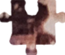

# Puzzle: Missing Piece

**Puzzle: Missing Piece**, is a image tool that allows you to end that puzzle that you couldn't finish because you lose one piece.
And it's obvious that you don't want to manually draw the piece based on a small reference image, because the result will be horrendous.

To avoid this annoying process, just taking two photos of the incomplete puzzle and the reference image, this tool generates the missing piece,
so you can print it to cut it and fill your empty and lonely puzzle hole. 

## How to get your missing piece

Download or clone this repository in your machine. This program uses Python3.6 (or higher). You can download if from the official [Python site](https://www.python.org/downloads/).

Dependencies are managed using [Pipenv](https://github.com/pypa/pipenv), so simply run the following command to install the required libraries:

```bash
$ pipenv install
```

To obtain the piece, run the main script `puzzle.py` specifying the following parameters:

- **Reference photo path:** Path to the photo of the puzzle reference (i.e. box model reference).
- **Puzzle photo path:** Path to the photo of the incomplete puzzle.
- **Puzzle width:** Width of the puzzle in cm. 
- **Puzzle height:** Height of the puzzle in cm.
- **Output path _(optional)_:** Directory to store the missing piece image to. If ignored, it is saved in the same directory as the reference photo.

As an example:

```bash
$ python src/puzzle.py ./resources/city/reference.jpg ./resources/city/puzzle.jpg 118.4 84.5
```

## How does it work?

Take two pictures of the puzzle.
The first picture (`reference_photo`) is a photo of the puzzle reference as shown (typically) in the puzzle box.
The second picture (`puzzle_photo`) is a photo of the real puzzle which has one missing piece.

<table>
  <tr>
    <td>Reference Photo</td>
    <td>Puzzle Photo</td>      
  </tr>
  <tr>
    <td></td>
    <td></td>
  </tr>
 </table>

Applying a projective transformation to both images with the puzzle vertices,
we get a frontal view of the puzzle of the same size for both reference and puzzle images.

<table>
  <tr>
    <td>Photo with marked vertices</td>
    <td></td>
    <td>Warped photo</td>
  </tr>
  <tr>
    <td></td>
    <td>&#8594;</td>
    <td></td>
  </tr>
  <tr>
    <td></td>
    <td>&#8594;</td>
    <td></td>
  </tr>
 </table>

By applying a new channel mask to the puzzle image, we index and extract the remaining pixels that define the piece
shape and colors, accessing them from the warped reference photo, and storing the obtained piece into a new image file.

<table>
  <tr>
    <td>Resulting Piece</td>
  </tr>
  <tr>
    <td></td>
  </tr>
</table>

## But... why?

   