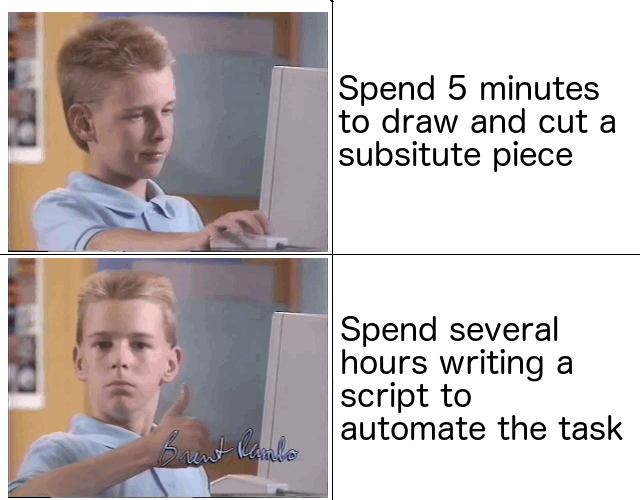
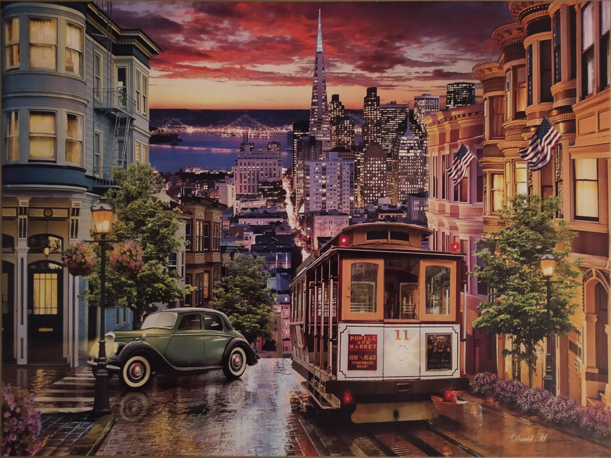
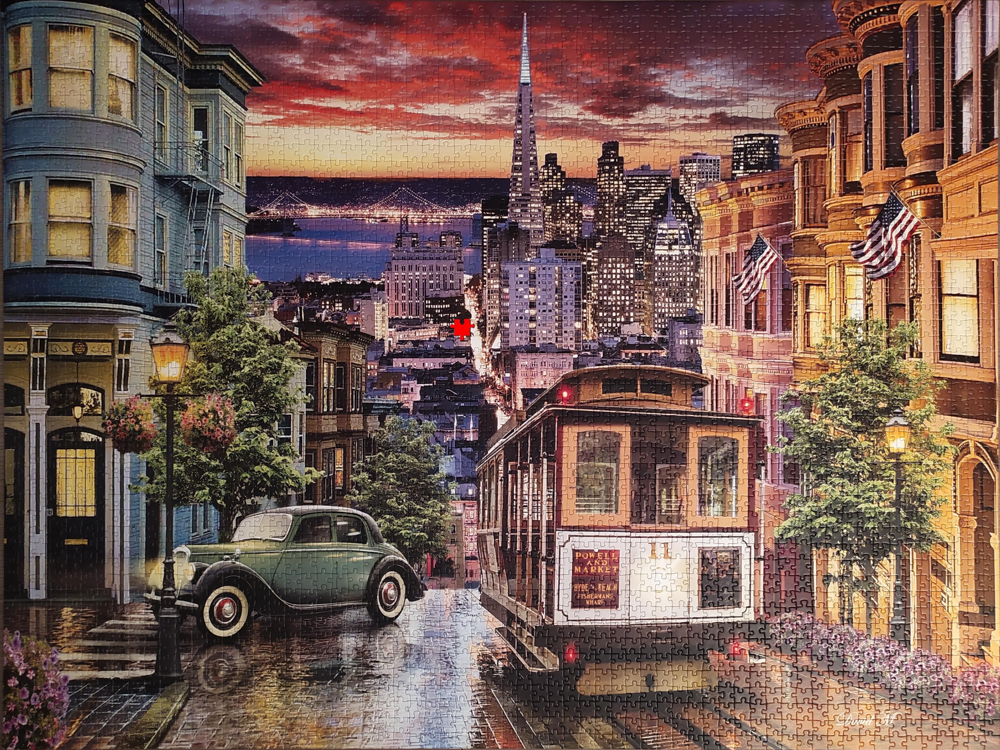

# Puzzle: Missing Piece



## How to get your missing piece

```bash

```

## How does it work?

Take two pictures of the puzzle.
The first picture (`model_photo`) is a photo of the puzzle model as shown (typically) in the puzzle box.
The second picture (`puzzle_photo`) is a photo of the real puzzle which has one missing piece.

<table>
  <tr>
    <td>Model Photo</td>
    <td>Puzzle Photo</td>      
  </tr>
  <tr>
    <td></td>
    <td></td>
  </tr>
 </table>

Applying a projective transformation to both images with the puzzle vertices,
we get a frontal view of the puzzle of the same size for both model and puzzle images.

<table>
  <tr>
    <td>Photo with marked vertices</td>
    <td></td>
    <td>Warped photo</td>
  </tr>
  <tr>
    <td></td>
    <td>&#8594;</td>
    <td></td>
  </tr>
  <tr>
    <td></td>
    <td>&#8594;</td>
    <td></td>
  </tr>
 </table>

By applying a new channel mask to the puzzle image, we index and extract the remaining pixels that define the piece
shape and colors, accessing them from the warped model photo, and storing the obtained piece into a new image file.   